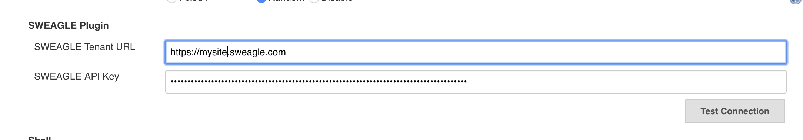

#          Jenkins Plugin   

SWEAGLE is a config data management platform supporting all types of config data from applications, to cloud and legacy infrastructure.  This plugin allows for checking in and upload config data into SWEAGLE so it can be versioned, validated, and made consumable in many different formats. 

The plugin supports for jenkins build steps ay for stages of a config data lifecycle. Click on the links below for more details on configuring each action

#### 			Upload --> Validate --> Snapshot --> Export

## Global Configuration

| SWEAGLE Tenant URL | SaaS or On-Premise URL of your SWEAGLE instance              |
| ------------------ | :----------------------------------------------------------- |
| SWEAGLE API Key    | API key from API type user with appropriate permssions required for automating SWEAGLE tasks |

Test the connection before saving.  A successful connection will show the amount of Metadata Sets available to the API Key.
## Upload Build Step

## Validate Build Step

## Snapshot Build Step

## Export Build Step

